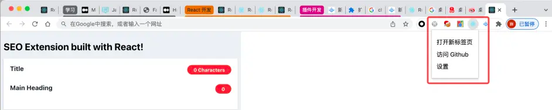
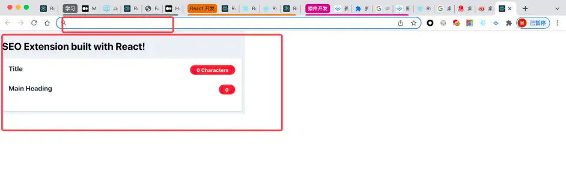
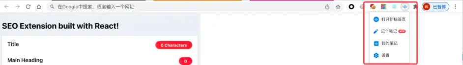
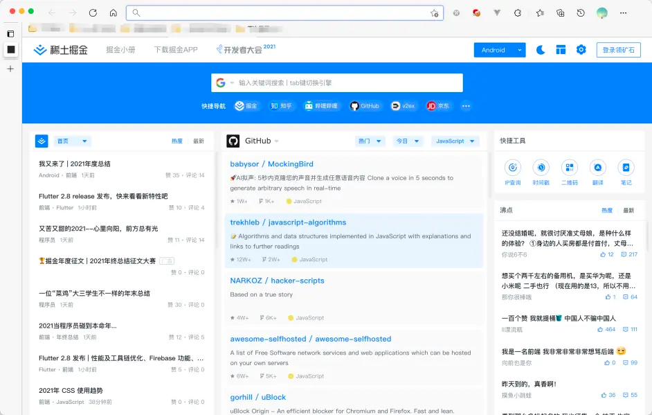
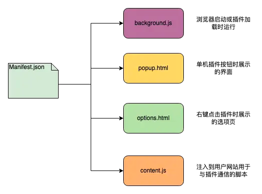
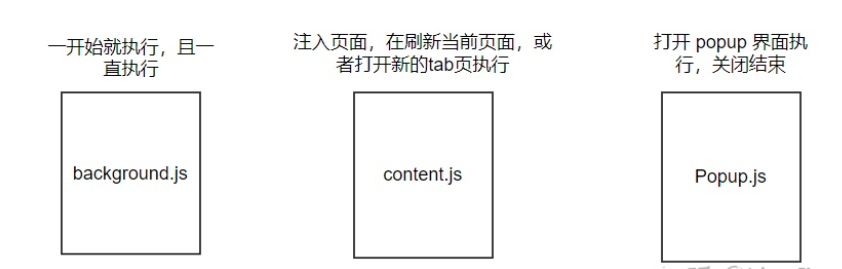
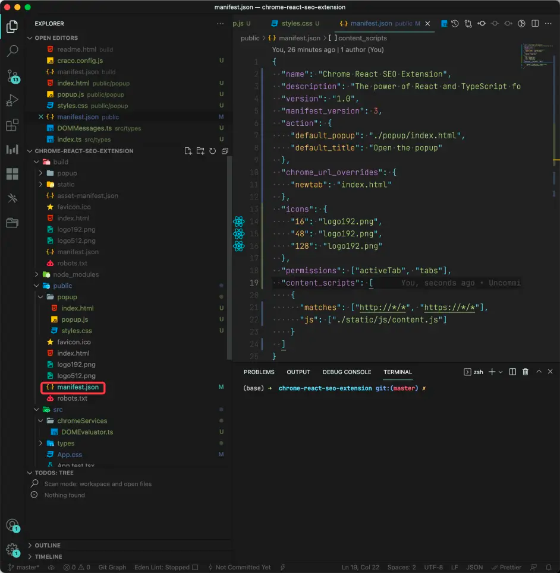
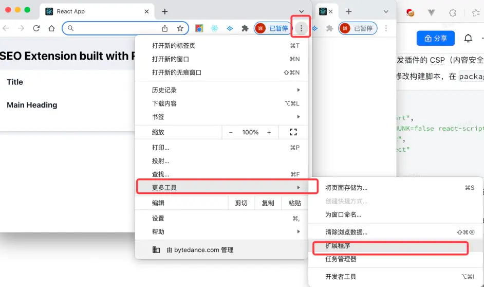
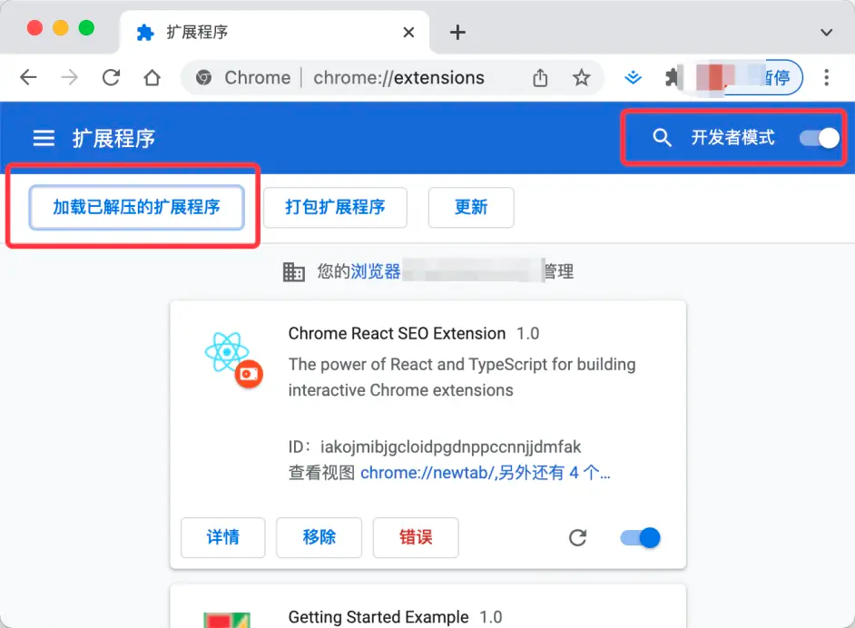

# Chrome Extension TypeScript Starter


Chrome Extension, TypeScript and Visual Studio Code

## Prerequisites

* [node + npm](https://nodejs.org/) (Current Version)

## Option

* [Visual Studio Code](https://code.visualstudio.com/)

## Includes the following

* TypeScript
* Webpack
* React
* Jest
* Example Code
    * Chrome Storage
    * Options Version 2
    * content script
    * count up badge number
    * background

## Project Structure

* src/typescript: TypeScript source files
* src/assets: static files
* dist: Chrome Extension directory
* dist/js: Generated JavaScript files

## Setup

```
npm install
```

## Import as Visual Studio Code project

...

## Build

```
npm run build
```

## Build in watch mode

### terminal

```
npm run watch
```

### Visual Studio Code

Run watch mode.

type `Ctrl + Shift + B`

## Load extension to chrome

Load `dist` directory

## Test

`npx jest` or `npm run test`


# 基础知识


这个浏览器支持传统的插件点击弹出栏，以及每次打开一个新 Tab 都能展示我的应用，这样能够帮助我随时了解我当前正在进行的工作，大致形式如下：

弹出栏：


新 Tab：



针对上面需求的形式不知道大家是否比较熟悉了？没错，这个插件的框架形式和 掘金 的插件类似，我们看下掘金的 Chrome 插件：

弹出框：



新 Tab：


也就是说，在看完本次文章，你基本上拥有了开发一个掘金插件的能力，心动了*？

随便一提，我们本次开发插件的技术栈如下：

React + TypeScript，基于 Create-React-App 脚手架搭建

通过先进的技术栈来编写 Chrome 插件🚀。

前置知识
Chrome 插件实际上包含几个部分：

manifest.json 文件，相当于整个项目的入口，里面记录着此插件的 icon 图标展示、弹出框样式文件、新建 Tab 逻辑、选项逻辑、内容脚本逻辑等

background.js，此脚本是在整个浏览器启动或者插件加载之后就会运行的一个脚本文件，它运行在 ServiceWorker 里面，通常用于进行一些前置的数据
storage 存储操作，可以操作所有的 Chrome API

popup.html，插件的弹出框展示的模板内容，可以通过 CSS 控制样式，JavaScript 控制逻辑

options.html，右键插件 icon 时弹出菜单页，点击菜单页里面的选项打开的页面

content.js，此脚本是在你打开一个新的网页的时候，Chrome 浏览器为这个网页注入的一个脚本文件，用于辅助此网页和你的插件进行一个通信，因为插件的运行环境是经过沙盒隔离的，无法直接操作到
DOM，所以需要通过 content 脚本操作 DOM，然后发送给到插件的处理逻辑

上述 5 大文件组成了一个 Chrome 插件所需要的必须元素，逻辑关系如下：


注意注意：background.js 和 popup.js 在 chrome 框架中执行的生命周期不同


可以看到，其实开发一个 Chrome 的插件也是使用 HTML/JavaScript/CSS 这些知识，只不过使用场景，每种 JavaScript 使用的权限与功能、操作的
API 不太一样，那么既然是使用基本的 Web 基础技术，我们就可以借助更为上层的 Web 开发框架如 React 等来将 Chrome
插件的开发上升到一个现代化的程度。

最简化插件
确保你安装了最新版的 Node.js，然后在命令行中运行如下命令：

npx create-react-app chrome-react-extension --template typescript

初始化好项目、安装完依赖之后，我们可以看到 CRA 产生的模板代码，其中就有我们需要的 public/manifest.json 文件：


当然内容并没有我们上图那样丰富我们需要做一些修改，将内容改为如下内容：

```json

{
  "name": "Chrome React Extension",
  "description": "使用 React TypeScript 构建 Chrome 扩展",
  "version": "1.0",
  "manifest_version": 3,
  "action": {
    "default_popup": "index.html",
    "default_title": "Open the popup"
  },
  "icons": {
    "16": "logo192.png",
    "48": "logo192.png",
    "128": "logo192.png"
  }
}

```

上述的字段说明如下：

name：插件的名字，展示在 Chrome 插件 icon 里面，以及插件市场等

description：简介插件时干嘛的

version：插件当前的版本

manifest_version：当前使用的 manifest 文件的版本，Chrome 插件最小的 manifest 版本是 V3

action：控制点击插件 icon 时的需要反应的动作（action），这里我们设置 hover 时展示的文字为 default_title，点击打开展示的内容为
index.html

icons：为展示在 Chrome 插件里面的图标

实际上 Chrome 插件只能理解原生的 JavaScript，CSS，HTML 等， 所以我们使用 React
学完之后，需要进行构建，将构建的产物打包给到浏览器插件去加载使用，在构建时，还有一个需要注意的就是，为了保证最优化性能，CRA
的脚本在构建时会将一些小的 JS 文件等，内联到 HTML 文件中，而不是打包成独立的 JS 文件，在 Chrome 插件的运行环境下，这种形式的
HTML 是不支持的，会触发插件的 CSP（内容安全策略）错误。

所以为了测试我们的插件当前效果，我们修改构建脚本，在 package.json 里面：

```json

"scripts": {
"start": "react-scripts start",
"build": "INLINE_RUNTIME_CHUNK=false react-scripts build",
"test": "react-scripts test",
"eject": "react-scripts eject"
},

```

通过设置 INLINE_RUNTIME_CHUNK=false 确保所有的 JS 会构建成独立的文件，然后引入到 HTML 中加载使用。

一切准备完毕，是时候构建我们的 React 应用了~ 在命令行中运行如下命令：

```
npm run build
```

会发现内容构建输出在 build/xxx 下面，包含 manifest.json、index.html、对应的 JS/CSS 文件还有图片等，其中 manifest 中索引了
index.html 来作为点击插件时的 Popup 的展示页，这个时候我们就可以使用 Chrome 加载我们构建好的文件，来查看插件运行效果了：

我们打开扩展程序面板，设置开发者模式，然后点击加载文件，选择我们的 build 文件地址加载：

Magic ！我们可以在浏览器里面看到我们的插件，并使用它了，一个最简化插件完成！

当然这里我们虽然能够使用 React/TypeScript 以及一切现代的 Web 开发技术来写插件，但是目前没有很好的方式能够实时的进行开发-查看效果，就是我们常见的
HMR、Live Reload 这种技术暂时还没有很好的支持到 Chrome 插件的开发，所以每次我们需要查看编写的效果都需要构建之后点击插件查看。

当然如果纯针对 UI 或者和 Chrome API 无关的逻辑，那么你可以放心的直接在 Web 里面开发，等到开发完毕再构建到 Chrome 插件预览即可。
# 官方插件文档
[官方文档](https://link.csdn.net/?target=https%3A%2F%2Fdeveloper.chrome.com%2Fdocs%2Fextensions%2Freference%2Fruntime%2F)
# 其他文档
## chrome extensions插件中popue.js和background.js进行通讯manifest V3版
[csdn](https://xiaoshen.blog.csdn.net/article/details/128832758)
